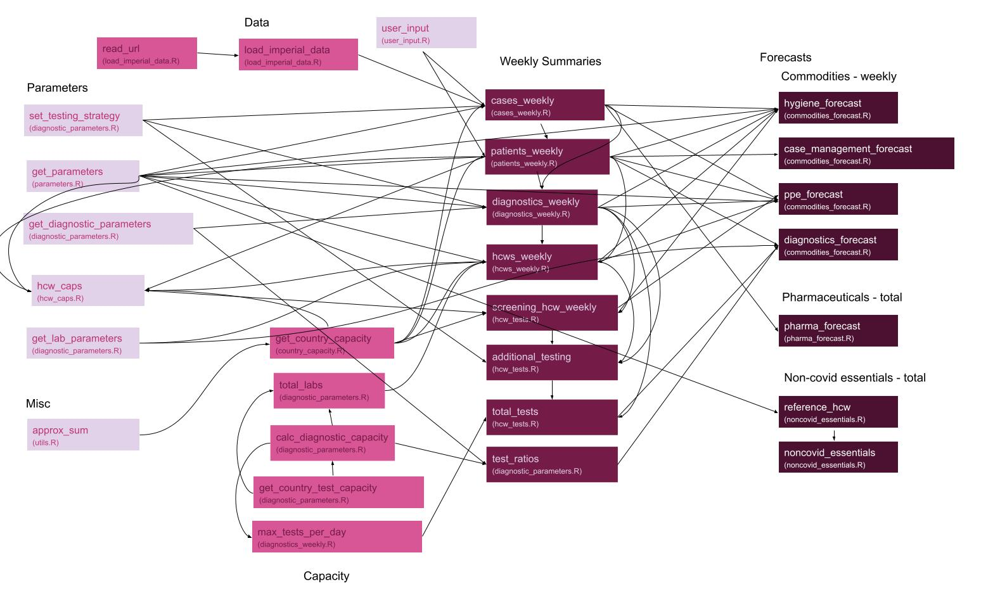

# Forecasting Equipment and Staff Needs Using the Calculations from the WHO Essential Supplies Forecasting Tool

Translating the WHO Essential Supplies Forecasting Tool into code.



## Installation

<i>esft</i> was written in R version 4.2.1 and is compatible with R >= 3.5.0, on Windows and iOS machines. The package depends on [countrycode v.1.4.0](https://vincentarelbundock.github.io/countrycode/), [gh v.1.3.1](https://gh.r-lib.org/), [magrittr v.2.0.3](https://magrittr.tidyverse.org/), [rlang v.1.0.6](https://rlang.r-lib.org/), [data.table v.1.14.6](https://rdatatable.gitlab.io/data.table/), [dplyr v.1.0.10](https://dplyr.tidyverse.org/), [tidyr v.1.2.1](https://tidyr.tidyverse.org/), and [tidyselect v.1.2.0](https://tidyselect.r-lib.org/).

Windows users should install
[Rtools](https://cran.r-project.org/bin/windows/Rtools/) in order for the package to compile.

The devtools package should also be installed by running:

``` r
install.packages("devtools")
```

Then install the <i>esft</i> package directly from GitHub by running:

``` r
devtools::install_github("mrc-ide/esft")
```

The package can then be loaded like so:

``` r
library(esft)
```
